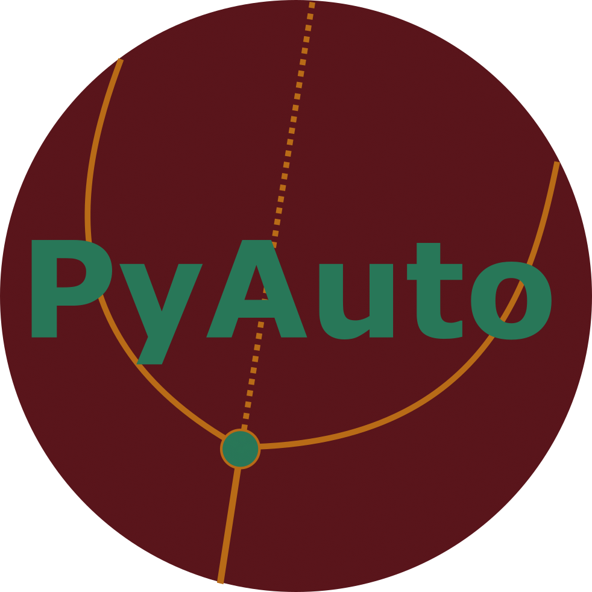

# PyAuto

[](https://github.com/pyrates-neuroscience/PyAuto)



*PyAuto* is a Python interface to *Auto-07p* [1]. It still requires user-supplied Fortran files for parameter continuations,
but allows for a more intuitive usage of *Auto-07p* commands within Python scripts. It provides direct access to 
solutions, branches, and their properties (i.e. special solutions, eigenvalues, etc.) as well as a range of plotting 
functions to visualize bifurcation diagrams and solutions.

**Use Example:** Use examples will be provided here soon. For now, have a look at the [this example](https://pyrates.readthedocs.io/en/latest/auto_analysis/continuation.html#sphx-glr-auto-analysis-continuation-py)
which demonstrates how to create the required Fortran files for *Auto-07p* via [PyRates](https://github.com/pyrates-neuroscience/PyRates)
and use them to run a 1D parameter continuation and bifurcation detection via *PyAuto*.

Installation
============

To use *PyAuto*, it is required to install [Auto-07p](https://github.com/auto-07p/auto-07p).
You can follow these [installation instructions](https://github.com/auto-07p/auto-07p/tree/master/doc) for detailed 
information on how to install *Auto-07p* in your specific setup.
Note that it is not required to manually set any path variables, since *PyAuto* will take care of that for you.  
A typical installation procedure would be the following:

**Step 1:** Clone the *Auto-07p* github repository:

```shell
git clone https://github.com/auto-07p/auto-07p
```

**Step 2:** Configure the installation scripts

Go to the directory that you cloned the *Auto-07p* repository into and call

```shell
./configure
```

**Step 3:** Install *Auto-07p*

In the same directory, call

```shell
make
```

**Step 4:** Install the Python version of *Auto-07p*

After that, in the same directory, execute the following call from within the Python environment that you would like to use for *PyAuto*

```shell
python setup.py install
```

**Step 5:** Install *PyAuto*

Use `pip` to install the latest stable version of *PyAuto*

```shell
pip install pyauto
```

Alternatively, the development version of *PyAuto* can be installed by cloning the github 
repository and using the `setup.py` for installation (see steps 1 and 4). 

References
==========
 
[1] E.J. Doedel, T.F. Fairgrieve, B. Sandstede, A.R. Champneys, Y.A. Kuznetsov and W. Xianjun (2007) *Auto-07p:
       Continuation and bifurcation software for ordinary differential equations.* Technical report,
       Department of Computer Science, Concordia University, Montreal, Quebec.
