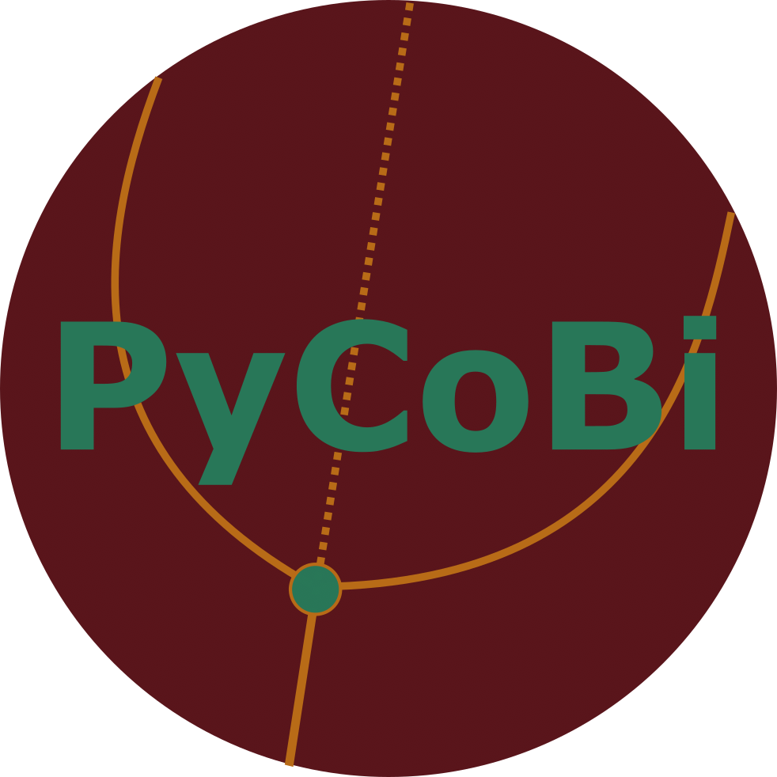

# PyCoBi

[](https://github.com/pyrates-neuroscience/PyCoBi)
[](https://badge.fury.io/py/pycobi)
[](https://badge.fury.io/py/pycobi)
[](https://circleci.com/gh/pyrates-neuroscience/PyCoBi)
[](https://pycobi.readthedocs.io/en/latest/?badge=latest)
[](https://zenodo.org/badge/latestdoi/448007450)



*PyCoBi* is a **Py**thon tool for parameter **co**ntinuations and automated **bi**furcation analysis.
It provides a Python interface to *Auto-07p* [1], allowing for a more intuitive usage of *Auto-07p* commands within Python scripts. 
It provides direct access to solutions, branches, and their properties (i.e. special solutions, eigenvalues, etc.) as well as a range of plotting 
functions to visualize bifurcation diagrams and solutions.
Finally, it allows to automatically generate the user-supplied Fortran routines via [PyRates](https://github.com/pyrates-neuroscience/PyRates),
such that *Auto-07p* can be fully used/controlled from within a single Python script, 
without the need to supply additional non-Python files.

Installation
============

To use *PyCoBi*, it is required to install [Auto-07p](https://github.com/auto-07p/auto-07p).
You can follow these [installation instructions](https://github.com/auto-07p/auto-07p/tree/master/doc) for detailed 
information on how to install *Auto-07p* in your specific setup.
Note that it is not required to manually set any path variables, since *PyAuto* will take care of that for you.  
A typical installation procedure would be the following:

**Step 1:** Clone the *Auto-07p* github repository:

```shell
git clone https://github.com/auto-07p/auto-07p
```

**Step 2:** Configure the installation scripts

Go to the directory that you cloned the *Auto-07p* repository into and call

```shell
./configure
```

**Step 3:** Install *Auto-07p*

In the same directory, call

```shell
make
```

**Step 4:** Install the Python version of *Auto-07p*

After that, in the same directory, execute the following call from within the Python environment that you would like to use for *PyAuto*

```shell
python setup.py install
```

**Step 5:** Install *PyCoBi*

Use `pip` to install the latest stable version of *PyCoBi*

```shell
pip install pycobi
```

Alternatively, the development version of *PyCoBi* can be installed by cloning the github 
repository and using the `setup.py` for installation (see steps 1 and 4). 

Documentation
=============

A full API, documentation, and use examples can be found at [readthedocs](https://pycobi.readthedocs.io/en/latest/).

References
==========
 
[1] E.J. Doedel, T.F. Fairgrieve, B. Sandstede, A.R. Champneys, Y.A. Kuznetsov and W. Xianjun (2007) *Auto-07p:
       Continuation and bifurcation software for ordinary differential equations.* Technical report,
       Department of Computer Science, Concordia University, Montreal, Quebec.
